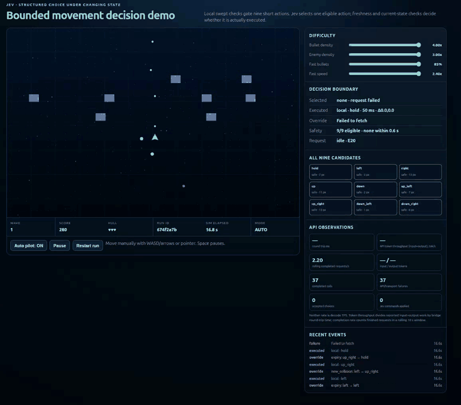

# Jev Space Shooter — local djev decision demo

A browser space shooter for exploring a practical question: **how do you turn a changing, continuous environment into a small decision problem that a local model can solve quickly enough?** The game is presented in a fixed 600 × 800 panel with a 2.5D Three.js arena, a live decision strip, and a compact control bar.

The game uses per-run provider settings, while a closed-by-default Diagnostics panel holds detailed observations, candidate paths, metrics, and history. Difficulty controls let you increase enemy count, bullet density, and the proportion and speed of fast bullets.

This project uses a **self-hosted [djev-spark](https://github.com/mmastrac/djev-spark) model endpoint**, not the official hosted Jev service. In the current controller, djev chooses movement and firing. The client computes physical observations and executes the returned command; it does not secretly replace a bad tactical choice with a better one.

This is a decision-modeling experiment, not a solved bullet-hell agent. It still makes mistakes, sometimes drifts toward boundaries, and remains sensitive to inference latency. The earlier 120-second survival target was withdrawn; no stable hardest-profile success is claimed.

## Demo video

**Historical prototype footage — not the current API-authoritative controller.** The supplied recording shows the earlier hybrid controller, including failed API requests and locally executed fallback actions. It illustrates the arena and dashboard, but must not be used as evidence that djev produced that play.

[](https://raw.githubusercontent.com/jstdlee/jev-spaceshooter-demo/main/docs/media/space-shooter-demo.webm)

**[Download the full recording — WebM, 14.5 MiB](https://raw.githubusercontent.com/jstdlee/jev-spaceshooter-demo/main/docs/media/space-shooter-demo.webm)** · [Still frame](docs/media/historical-prototype-poster.png)

The inline animation is an 8-second, real-time excerpt; the original video is approximately 84.6 seconds. GitHub's file viewer does not preview the original at this size, so the full-recording link goes directly to the WebM for download and playback. Both assets are stored in this repository. See [media provenance](docs/media/README.md) for the source, conversion details, and limitations. Run the demo below for the current implementation; its measured results are listed separately under [Results](#results-and-their-limits).

## Run locally

### Dependencies

- A modern browser with WebGL for the Three.js game. Three.js 0.186.0 is loaded from jsDelivr; allow CDN access. If WebGL or module loading fails, the game displays a warning and falls back to its Canvas renderer. No Gradio, React, npm install, or frontend build is needed.
- Python **3.10+** for the HTTP bridge, using only the standard library.
- A running **djev-spark structured API** at `POST /v1/systemone`.
- Node.js **22** for the tested offline suites and optional CLI benchmarks; not needed just to open the game through the Python bridge.

The development endpoint used DiffusionGemma 26B-A4B NVFP4 through djev-spark and its patched vLLM runtime. Model weights, GPU resources, containers, and their dependencies are **not bundled here**. Follow the upstream [djev-spark setup](https://github.com/mmastrac/djev-spark) for the model-serving environment and its licenses. A generic `/v1/chat/completions` endpoint is not a drop-in replacement.

### Start the bridge

```bash
git clone https://github.com/jstdlee/jev-spaceshooter-demo.git
cd jev-spaceshooter-demo
cp .env.example .env
```

Edit `.env` to match your structured model server:

```dotenv
DJEV_URL=http://127.0.0.1:8011
DJEV_API_KEY=
DJEV_MODEL=jev-latest
```

`jev-latest` is the bridge's default compatibility identifier, **not a claim that an official Jev model is running**. Configure the identifier accepted by your own server. The in-game **Model settings** dialog can override the provider URL and model for the next run in the current browser tab. The URL is a base URL: the bridge appends `/v1/systemone`, so do not include that path yourself. Settings are session-scoped and sent only to the local bridge as part of `/api/run/start`; the bridge captures them for that run. `DJEV_URL` and `DJEV_MODEL` remain the defaults, including for clients that do not send overrides. Set `DJEV_API_KEY` only in the server environment (or local `.env`) if the endpoint requires a bearer key; it is never returned by `/api/config` or sent to the browser. Process environment variables override `.env`; `.env` is ignored by Git.

```bash
python3 demo/space_shooter_server.py --host 127.0.0.1 --port 7865
```

Open **[http://127.0.0.1:7865/](http://127.0.0.1:7865/)**. The centered 600 × 800 game panel scales to fit smaller screens without page scrolling. Use **Auto pilot**, **Pause**, **Restart**, and **Model settings** in the control bar; live command validity and application counts remain visible below the arena. Open **Diagnostics** for observations, forecast candidates, and detailed metrics. Watch both *valid djev commands* and *applied djev commands* increase. Opening the HTML with `file://` does not provide the Python API bridge. A green `/health` response checks the bridge only, not successful model inference.

Keep the bridge on loopback for this local demo. The browser never needs the upstream API key. GitHub hosts the source and media, not a running model or Python backend.

## Who decides what?

```text
HTML game: positions, velocities, all nine physical path forecasts
    │ POST /api/decision
    ▼
Python bridge: validate and compact the observations
    │ POST /v1/systemone — one request, three choices
    ▼
Self-hosted djev-spark → local model
    │ intent + movement path + shoot/cease
    ▼
Bridge normalization → client validity/freshness checks → game physics
    └────────────────────── next observation ──────────────────────┘
```

| Component | Responsibility | Does not do |
| --- | --- | --- |
| HTML client | Render and simulate the game; observe positions/velocities; forecast each candidate path; execute accepted commands | Rank or filter tactical actions, veto a valid but dangerous direction, or supply fallback steering |
| Python bridge | Validate schemas, compact factual inputs, call djev, normalize the three answers, keep credentials server-side | Choose a winner, synthesize a movement answer, or replace an unsafe answer |
| Local djev model | Choose intent, one of nine paths, and shooting state | Run the game physics or inspect future random spawns |
| Protocol controller | Check run/epoch/sequence, response age, and command expiry | Decide which direction is tactically safer |

**Local trajectory calculation is still substantial preprocessing.** The model is not discovering collision geometry from pixels: it is selecting an action from engineered physical forecasts. What this demonstrates is structured model decision-making over those observations—not end-to-end visual intelligence or model-only trajectory prediction.

All nine paths are offered, even when some forecast a collision. There is no safety mask, local ranking, bomb, local rescue controller, or independent autofire in model mode. A valid but tactically wrong model choice is executed. Invalid, missing, expired, or stale authorization instead produces neutral **hold + cease**; that is a protocol rule, not an evasive maneuver.

### One atomic decision

Each upstream request uses `samples: 1` and `steps: 1`, with three choice questions in the same call:

| Choice | Values | Meaning |
| --- | --- | --- |
| `intent` | `evade`, `recover`, `position` | The model's description of its current intent |
| `path` | `hold__medium`, four cardinal and four diagonal directions | Which movement to execute |
| `fire` | `shoot`, `cease` | Whether the normal weapon cooldown may emit shots |

For example, the answer fields may be:

```json
{
  "answers": {
    "intent": {"choice": "recover"},
    "path": {"choice": "up_right__medium"},
    "fire": {"choice": "shoot"}
  }
}
```

The bridge maps `up_right__medium` to `movement: "up_right"` and `lease: "medium"`. All three choices must validate together. Intent is descriptive: a `recover` label does not activate a hidden client-side return-to-center routine. It can disagree with the quality of the selected movement.

Physics runs at 60 ticks/s. Each medium command authorizes at most **30 ticks / 500 ms**, and a newer valid answer can preempt it on the next tick. One request is pending per game; the next request starts after the previous one completes. Thus 500 ms is an authorization ceiling, not a mandatory wait between decisions. The current response-age limit is 600 ms.

## Current decision model

### Observations, not instructions disguised as scores

The compact state contains the player, whether it is inside the center region, whether holding forecasts a collision, the hold-path gap, estimated API delay, waiting-prefix collision time, and enemy count. It does not send the complete game world or duplicate a large path table.

Instead, each of the nine choice descriptions carries the corresponding physical facts directly:

| Fact | Interpretation |
| --- | --- |
| `collision` / `collision_ms` | Predicted collision and time from the observation, after estimated response arrival and known invulnerability expiry |
| `gap_px` | Minimum swept clearance over that vulnerable forecast window |
| `wall_room` | Minimum body-to-wall distance at the forecast endpoint |
| `center_progress` | Current distance to arena center minus forecast endpoint distance; positive means closer |

The arena is 960 × 620; its center is `(480,310)`, and the intent-classification center region is `x=360..600`, `y=230..390`. Right increases x; down increases y. These facts do not mark a winning action. The model still has to compare them.

The forecast accounts for the active command during expected API wait, then the proposed movement. Its horizon is at least 600 ms and extends through estimated delay plus the 500 ms lease. Existing bullets use observed velocity; enemies use a current-linear approximation. Future shots/spawns and hidden random state are excluded. A missing clearance measurement is not a promise of safety, especially when invulnerability covers the window.

Richer enemy-spacing and shot-interception forecasts exist in the client/UI, but are **not current live decision fields**. The current fire question asks the model to shoot when enemies exist; it is not a sophisticated target-pursuit planner.

### Tactical priorities sent to djev

1. Prefer a non-colliding path. Avoidance outranks returning to center.
2. When holding is dangerous or its gap is narrow, seek more clearance—even if that temporarily moves away from center.
3. Otherwise favor positive center progress to recover maneuvering room. Near the center, a small reposition can be preferable to waiting in a narrow gap.
4. If all paths collide, prefer the latest predicted contact. This is only an attempt to buy time, not a guarantee of escape.

These are **model instructions**, not conditional steering code in the game. The model can fail to follow them. The shared framing is in [strategy.md](demo/strategy.md); factual option construction and question-specific instructions are in [space_shooter_server.py](demo/space_shooter_server.py), especially `_path_table`, `build_path_criteria`, `pack_model_context`, and `build_upstream_payload`.

## Difficulty: why “just dodge” is not enough

| Setting | Browser default | `dense-mid-speed` | `hardest` |
| --- | ---: | ---: | ---: |
| Bullet density | 1× | 4× | 4× |
| Enemy density | 1× | 3× | 3× |
| Fast-bullet proportion | 0% | 85% | 85% |
| Fast-bullet speed multiplier | 1.6×, inactive at 0% | 1.7× | 2.4× |

The firing baseline is **0.95 seconds**, twice the firing frequency of the earlier 1.9-second baseline. At 4× density, the interval is 0.2375 seconds; projectile patterns can emit more than one bullet. Enemy density changes enemy count, while fast-bullet proportion controls which new bullets receive the speed multiplier. Sliders change the environment, not model intelligence.

Several objectives compete:

- **Immediate safety vs. future room.** A large gap at the edge can be a trap one decision later. Always maximizing clearance can push the ship into a corner.
- **Recovery vs. crossing danger.** Always moving toward center can cross a stream that a temporarily outward step would avoid.
- **Prediction vs. delay.** A correct snapshot decision may arrive too late; newly fired close-range bullets were not present in the snapshot.
- **Movement size vs. frequency.** Long sweeps cross unobserved danger. Short authorizations help only when fresh decisions arrive often enough.
- **Shooting vs. positioning.** Survival, firing opportunity, and wave completion are different objectives; surviving with enemies still alive is not clearing the game.

The current player remains 20 × 18 pixels, starts with three lives, moves at 112 px/s under model control, and uses a 0.17-second weapon cooldown. The latest prompt experiments did not improve scores by changing these physics, difficulty, hitboxes, or invulnerability.

## How the strategy was discovered

The useful loop was **form a hypothesis → change one representation or instruction → test fixed situations → try new situations → run real games → keep or reject the change**.

We compared larger contexts, compact path tables, inline factual choice descriptions, different recovery instructions, and single-call versus staged questions. Putting facts beside each option reduced the model's need to join a state table to a separate action list. Removing duplicated information retained useful observations without increasing round-trip time. Separate/staged questions cost roughly 460–480 ms in development probes and did not justify that delay for this controller.

In one 22-case development comparison, the path-table formulation selected a colliding route despite clear alternatives eight times; the adopted inline formulation did so zero times. **Those cases were used for tuning, not held-out proof.** Extra fields and stronger center-return wording sometimes improved selected fixtures while producing worse continuous play. A later “enough clearance, then return inward” candidate was not retained because live runs did not establish a benefit, with concurrent load also confounding the comparison.

For a useful experiment:

1. Keep physics, difficulty, seed, model configuration, and time limit explicit.
2. Include corners, clear center, incoming bullets, blocked centerward routes, and unavoidable-collision situations—not just successful examples.
3. Test a new seed or situation after tuning; once used to tune, it is no longer a holdout.
4. Measure actual survival, remaining lives, score/wave, invalid answers, latency, and applied-command rate. A correct intent label alone is insufficient.
5. Run one game against the model when comparing prompts. Browser preview plus CLI testing shares inference capacity.
6. Preserve a better-performing version when a more elaborate decision tree fails to generalize.

## Results and their limits

Development observations from **2026-09-20**, using the adopted inline-choice formulation and `dense-mid-speed`, with a 45-second test limit:

| Seed / attempt | Outcome | Lives left | API calls | Median API latency |
| --- | --- | ---: | ---: | ---: |
| 20260921 | Reached 45-second stop | 3 | 205 | 201 ms |
| 20260920 | Died at 42.9 s | 0 | 184 | 203 ms |
| 20260922, first | Died at 20.5 s | 0 | 52 | 377 ms |
| 20260922, repeat | Reached 45-second stop | 1 | 112 | 378 ms |

All four returned valid protocol choices, but two runs still died. The latter two overlapped browser inference; the second run also overlapped near its end. They are not a controlled, statistically significant comparison. Reaching the test stop means survival was observed **up to that stop**, not that the ship subsequently survived indefinitely. Results are development-log summaries; raw local run directories are not shipped in this repository.

An earlier formulation reached 64.15 seconds in a different development run. That result is not attributed to this prompt. There is **no demonstrated stable 120-second survival or hardest-profile pass**. The older target is no longer a completion gate; legacy qualification fields in the runner may still refer to it.

Typically, an otherwise idle endpoint completed a decision in about 200–230 ms: roughly 4–5 decisions/s, not 60 decisions/s. Concurrent games increased observed latency to about 380–400 ms. Game physics continuing at 60 Hz does not make a 200 ms model decision a 60 Hz reflex.

## Tests and optional benchmarks

Offline tests require no running model:

```bash
node demo/test_space_shooter_logic.cjs
node demo/test_benchmark.cjs
node demo/test_strategy_regression.cjs
python3 -B -m unittest discover -s demo -p 'test_space_shooter.py' -v
```

The publication check covers 35 core/controller/UI cases, 49 benchmark cases, 10 scenario-harness cases, and 24 Python bridge cases: **118 tests**. These validate software behavior, not tactical quality.

With the bridge and model running, pause other model-controlled games before a bounded live test:

```bash
node demo/benchmark.cjs --seed 20260921 --profile dense-mid-speed --target-seconds 45 --url http://127.0.0.1:7865
```

Use `--profile hardest` only when deliberately testing the 2.4× fast-bullet setting, and label it accordingly. The physical simulation is seeded; full live games are not necessarily repeatable because response timing and model output can differ.

```bash
# Fixed diagnostic situations; not a survival benchmark.
node demo/strategy_regression.cjs --url http://127.0.0.1:7865

# Optional replay of your own local run.
node demo/benchmark.cjs --replay demo/runs/<run_id>/events.jsonl
```

The scenario harness retains strict recovery/position expectations from the design process. A live model can fail them even when offline harness tests pass. Do not weaken an expectation merely to advertise a better pass rate. Pausing, manual input, restarting, changing difficulty, or excessive scheduling lag prevents treating that browser run as a controlled benchmark.

### Reading the dashboard

- **Selected vs. executing:** receiving a response is not the same as applying a fresh command.
- **API token throughput:** reported input plus output tokens divided by request duration; **not generation/decode TPS**.
- **Requests/s:** completed calls over the recent window, not the animation frame rate.
- **Intent probability `p`:** confidence in the returned label, not calibrated survival probability.
- **Run integrity:** recording completeness, not a survival or strategy success badge.

Existing local JSONL logging and replay remain available; they are optional development tools, not the focus of this demo. `.env`, credentials, model weights, raw API-state dumps, and generated run directories must not be committed. Review diagnostic files before sharing because they may contain endpoint identifiers or local paths.

## What we learned

**Designing the decision problem is much of the work.** Choosing useful observations, time horizons, action granularity, competing objectives, and acceptance tests took repeated modeling and regression experiments. It resembles a training/evaluation loop in effort and discipline, but **no model weights were trained**: the work tuned prompts, context, and action representation around a fixed local model.

**A good-looking demo can prove the wrong thing.** The earlier hybrid controller used fast local collision screening, ranking, and overrides; the model only helped choose within a locally constrained problem. That architecture can work well as a fast safety controller plus a slower policy, but its survival cannot be credited to the model alone. Establishing the model's incremental benefit would require an otherwise matched local-only ablation. The supplied video makes this distinction especially important: it shows local movement even while API calls fail.

**Validity is not tactical competence.** A perfectly formatted answer, a plausible `recover` label, or high confidence can still steer into danger. The current implementation deliberately exposes those mistakes rather than silently rescuing them.

**More context and more rules are not automatically better.** Extra facts increase reading/comparison work; extra API stages cost reaction time. “Maximize clearance,” “always return to center,” and “move more frequently” each fail in some situations. Priorities must be tested together under the actual latency budget.

**Regression testing is part of strategy discovery.** Preserve difficult situations, compare multiple seeds, separate tuned cases from holdouts, keep difficulty fixed, and report unsuccessful runs alongside successes. A static improvement may not survive a moving environment. Prefer measured, bounded claims over a polished animation or one lucky long run.
